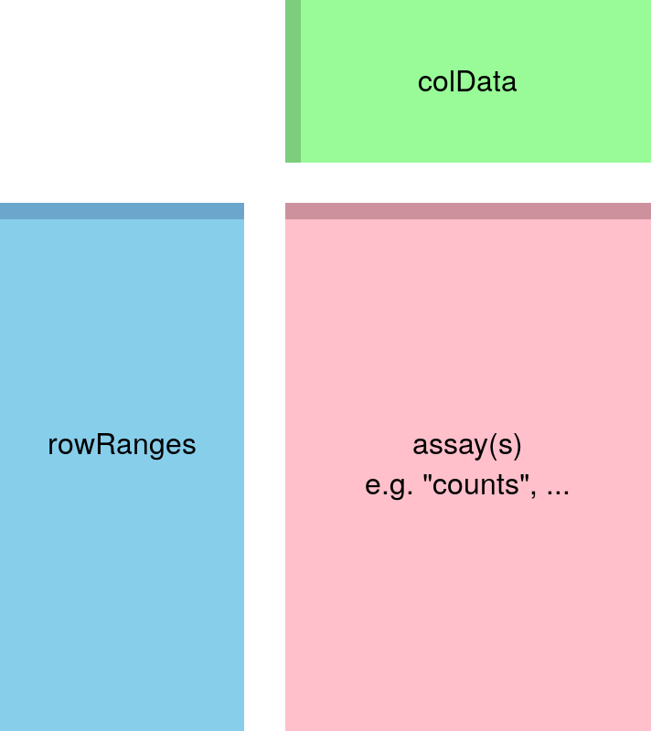

```{r setup, include=FALSE}
knitr::opts_chunk$set(echo = TRUE)

bioc_packages <- c(
    "DESeq2","EnhancedVolcano"
  )
cran_packages <- c(
  "enrichR","ggpubr","pheatmap","ggplot2","VennDiagram","stringr"
)
bioc_np <- bioc_packages[!(bioc_packages %in% installed.packages()[,"Package"])]
cran_np <- cran_packages[!(cran_packages %in% installed.packages()[,"Package"])]
if (!require("BiocManager")) install.packages("BiocManager")

if(length(cran_np)) {
  install.packages(cran_np)
}

if(length(bioc_np)) {
  BiocManager::install(bioc_np)
}

#library(RColorBrewer)
#library(Polychrome)
library(ggplot2) 
#library(tidyverse)
#library(dabestr)
library(enrichR)
#library(ggpubr)
#library(Hmisc)
library(ggpubr)
library(EnhancedVolcano)
library(VennDiagram)
#library(ggrepel)
#library(ggfortify)
library(pheatmap)
library(DESeq2)


knitr::opts_knit$set(root.dir = "C:/Users/flyku/Documents/GitHub/RNA-seq-pipeline/rnaseq")

```


# Goal

The primary goal of this study is to identify gene expression difference between conditions.

Rmarkdown reference can be found in here: [Reference](https://rstudio.com/wp-content/uploads/2015/03/rmarkdown-reference.pdf)

How to experimental design in DESeq2 (https://rpubs.com/ge600/deseq2)

[Mathematics in Rmarkdown](https://www.calvin.edu/~rpruim/courses/s341/S17/from-class/MathinRmd.html)

[Analyzing RNA-seq data with DESeq2](http://bioconductor.org/packages/release/bioc/vignettes/DESeq2/inst/doc/DESeq2.html#independent-hypothesis-weighting)

[RNA-seq workflow: gene-level exploratory analysis and differential expression](http://bioconductor.org/packages/release/bioc/vignettes/IHW/inst/doc/introduction_to_ihw.html#an-example-rna-seq-differential-expression)


Limma is actually better than DESeq2 in terms of controlling false positives: [RNA-seq analysis is easy as 1-2-3 with limma, Glimma and edgeR](https://www.bioconductor.org/packages/devel/workflows/vignettes/RNAseq123/inst/doc/limmaWorkflow.html)

# Methods

* Differential expression (DE) analysis was performed using the DESeq2 package. Genes were ranked for evidence of DE by their adjusted P values (smallest to largest). The table shows differentially expressed genes with absolute log fold-change > 1.5
* The identified differentially expressed genes with absolute log fold-change > 1.5 and Benjamini–Hochberg adjusted P values < 0.05 were submited to Enrichr v2.1 R package for enrichment analysis. The term databases are KEGG_2019_Mouse, GO_Molecular_Function_2018, GO_Biological_Process_2018, GO_Cellular_Component_2018 provided in Enrichr.
* Plots were generated using ggplot2 R package.

# Pre-processing

## Load dataset

Using raw read count as input.




```{r,echo=F,eval=T,message=F,warning=F,error=F}
## Change to human or mouse 
dbs <- c("GO_Molecular_Function_2018", "GO_Cellular_Component_2018", "GO_Biological_Process_2018","KEGG_2019_Mouse")

counts <- read.csv("counts.csv",stringsAsFactors = F,check.names = F)
meta <- read.csv("meta.csv",stringsAsFactors = F)

# Remove duplicated row names
if(length(which(duplicated.default(counts[,1]))) > 0 ){
    counts <- counts[-which(duplicated.default(counts[,1])==T),]
  }	
  
rownames(counts) <- counts[,1]
counts <- counts[,-1]

# You can filter the genes with low counts, it is called most minimal filtering rule: removing rows of the dataset that have no counts, or only a count of 10 across all samples. The value can be adjusted based on your dataset condition.
keep <- rowSums(counts) >= 10

# For some datasets, it may make sense to perform additional filtering. For example, one can specify that at least 5 samples have a count of 10 or higher. One recommendation for the number of samples would be set to the smallest group size. 
keep <- rowSums(counts >= 10) >= 5

counts <- counts[keep, ]

# For example use and speed up the process, we only select top 4000 genes for downstream analysis, remember to delete this line

counts <- counts[sample(1:nrow(counts),4000),]

# Overview of the dataset
counts[1:10, 1:10]
meta[1:10,]
```

## Load dataset in DESeq2

```{r,echo=F,eval=T,message=F,warning=F,error=F}
# choose whahtever column as design
dds <- DESeq2::DESeqDataSetFromMatrix(
  countData = counts,
  colData = meta,
  design = ~ injury
)

vsd <- vst(dds, blind = FALSE)

```

# Discovery driven analysis

## Principle component analysis

Related to the distance matrix is the PCA plot, which shows the samples in the 2D plane spanned by their first two principal components. PCA plot is used for visualizing the overall effect of experimental covariates and batch effects.

### PCA plot colored by injury

```{r,echo=F,eval=T,message=T,warning=F,error=F}
pcaData <- plotPCA(vsd, intgroup=c("injury"), returnData=TRUE)
percentVar <- round(100 * attr(pcaData, "percentVar"))
ggplot(pcaData, aes(PC1, PC2, color=injury)) +
  geom_point(size=3) +
  xlab(paste0("PC1: ",percentVar[1],"% variance")) +
  ylab(paste0("PC2: ",percentVar[2],"% variance")) + 
  coord_fixed() +
  theme_classic()

```

### PCA plot colored by time

```{r,echo=F,eval=T,message=T,warning=F,error=F}
pcaData <- plotPCA(vsd, intgroup=c("time"), returnData=TRUE)
percentVar <- round(100 * attr(pcaData, "percentVar"))
ggplot(pcaData, aes(PC1, PC2, color=time)) +
  geom_point(size=3) +
  xlab(paste0("PC1: ",percentVar[1],"% variance")) +
  ylab(paste0("PC2: ",percentVar[2],"% variance")) + 
  coord_fixed()+
  theme_classic()

```

### PCA plot colored by skin

```{r,echo=F,eval=T,message=T,warning=F,error=F}
pcaData <- plotPCA(vsd, intgroup=c("skin"), returnData=TRUE)
percentVar <- round(100 * attr(pcaData, "percentVar"))
ggplot(pcaData, aes(PC1, PC2, color=skin)) +
  geom_point(size=3) +
  xlab(paste0("PC1: ",percentVar[1],"% variance")) +
  ylab(paste0("PC2: ",percentVar[2],"% variance")) + 
  coord_fixed()+
  theme_classic()

```

### PCA plot based on color for time, shape for skin, size for injury

```{r,echo=F,eval=T,message=T,warning=F,error=F}
pcaData <- plotPCA(vsd, intgroup=c("skin","time","injury"), returnData=TRUE)
percentVar <- round(100 * attr(pcaData, "percentVar"))
ggplot(pcaData, aes(PC1, PC2, color=time, shape=skin, size=factor(injury))) +
  geom_point() +
  xlab(paste0("PC1: ",percentVar[1],"% variance")) +
  ylab(paste0("PC2: ",percentVar[2],"% variance")) + 
  coord_fixed()+
  theme_classic() +
  labs( size="Injury", shape="Skin", color="Time") 

```

## Sample correlation heatmap

The heatmap shows the sample-sample correlation matrix.

```{r,echo=F,eval=T,message=F,warning=F,error=F}

cts <- assay(vsd)
cor.mat <- cor(cts)

my_sample_col <- meta[, 2:4]
rownames(my_sample_col) <- meta$Name
pheatmap(
        mat = cor.mat,
        cluster_rows = T,
        cluster_cols = T,
        main = "Sample-Sample Correlation",
        annotation_col = my_sample_col,
        show_rownames=FALSE,
        show_colnames = FALSE
)

```

## Sample distance heatmap


The heatmap shows the sample-sample distance matrix. The dendrogram at the side shows us a hierarchical clustering of the samples

```{r,echo=F,eval=T,message=F,warning=F,error=F}

sampleDists <- dist(t(assay(vsd)))
sampleDistMatrix <- as.matrix(sampleDists)

my_sample_col <- meta[, 2:4]
rownames(my_sample_col) <- meta$Name
pheatmap(
        mat = sampleDistMatrix,
        cluster_rows = T,
        cluster_cols = T,
        main = "Sample-Sample Distance",
        annotation_col = my_sample_col,
        show_rownames=TRUE,
        show_colnames = TRUE
)

```

## Heatmap of the 30 most expressed IDs

The values in the heatmap are the normalized gene expression value minus the mean value for each gene.

```{r,echo=F,eval=T,message=T,warning=F,error=F, fig.width=10, fig.height=12}

heat.counts <- assay(vsd)
num <- 30
topID <- order(rowMeans(heat.counts), decreasing = TRUE)
heat.mat <- heat.counts[topID, ]
heat.mat <- heat.mat - rowMeans(heat.mat)
heat.mat <- heat.mat[1:num, ,drop = FALSE]
rownames(heat.mat)
colnames(heat.mat) <- meta$sample
my_sample_col <- meta
rownames(my_sample_col) <- meta$sample
my_sample_col <- meta[,c(4,5,3)]
rownames(my_sample_col) <- meta$sample

pheatmap(
        mat = heat.mat,
        cluster_rows = T,
        cluster_cols = T,
        main = "Heatmap of the 30 most expressed IDs",
        annotation_col = my_sample_col,
        show_rownames=T,
        show_colnames = T
)

```


# Diffrential gene expression analysis

The first column, baseMean, is a just the average of the normalized count values, divided by the size factors, taken over all samples in the DESeqDataSet.

The column log2FoldChange is the effect size estimate. It tells us how much the gene’s expression seems to have changed due to treatment in comparison to untreated samples. In another words, This value is reported on a logarithmic scale to base 2: for example, a log2 fold change of 1.5 means that the gene’s expression is increased by a multiplicative factor of $2^{1.5} \approx 2.82$. A positive log2 fold-change values show that the gene is more highly expressed in the first group and is labelled as 'up-regulated'.

lfcSE, the standard error estimate for the log2 fold change estimate, meaning its uncertainty associated with fold changes.

The purpose of a test for differential expression is to test whether the data provides sufficient evidence to conclude that this value is really different from zero. DESeq2 performs for each gene a hypothesis test to see whether evidence is sufficient to decide against the **null hypothesis that there is zero effect of the treatment on the gene and that the observed difference between treatment and control was merely caused by experimental variability**. As usual in statistics, the result of this test is reported as a p value, and it is found in the column pvalue. **Remember that a p value indicates the probability that a fold change as strong as the observed one, or even stronger, would be seen under the situation described by the null hypothesis**.


## 7 dpw lam wound tissues vs sci wound tissues

```{r,echo=F,eval=T,message=T,warning=F,error=F}

  s1 <- subset(meta, meta$injury == "lam" & meta$time == "7dpw" & meta$skin == "wound")
  s2 <- subset(meta, meta$injury == "SCI" & meta$skin == "wound")

  cells.1 = rownames(s1)
  cells.2 = rownames(s2)
  
  group.info <- data.frame(row.names = c(cells.1, cells.2))
  group.info[cells.1, "group"] <- "Group1"
  group.info[cells.2, "group"] <- "Group2"
  group.info[, "group"] <- factor(x = group.info[, "group"])
  group.info$wellKey <- rownames(x = group.info)
  
  dds1 <- DESeq2::DESeqDataSetFromMatrix(
    countData = counts[,as.numeric(c(cells.1, cells.2))],
    colData = group.info,
    design = ~ group
  )
  dds1 <- DESeq2::estimateSizeFactors(object = dds1)
  dds1 <- DESeq2::estimateDispersions(object = dds1, fitType = "local")
  dds1 <- DESeq2::nbinomWaldTest(object = dds1)
  res <- DESeq2::results(
    object = dds1,
    contrast = c("group", "Group1", "Group2")
  )
  res <- res[order(res$padj),]
  resLFC <- res
  
summary(resLFC, alpha=0.05)

DT::datatable(as.data.frame(resLFC), extensions = 'FixedColumns',
              options = list(
                pageLength = 20,
                scrollX = TRUE,
                scrollCollapse = TRUE,
                dom = 'Bfrtip',
                buttons = c('copy', 'csv', 'excel', 'pdf', 'print')
              ))

#write.csv(resLFC,"comparison1.csv")

```


### MA-plot


The MA-plot visualize the log2 fold-change (M) on Y-axis and log of the mean of expression counts of samples (A) on X-axis. Genes with similar expression values in both compared groups will cluster around M=0 value (grey dots). i.e genes expressed with no significant differences in two groups. Up-regulated genes are colored in red, and down-regulated genes are colored in blue. I annotated 10 genes with smallest p-values in the figure. 

```{r, fig.width=10, fig.height=10,echo=F,message=T,warning=F}

ggmaplot(resLFC,
         fdr = 0.05, fc = 1.5, size = 0.5,
         palette = c("#B31B21", "#1465AC", "darkgray"),
         genenames = as.vector(rownames(resLFC)),
         legend = "top", top = 10,
         font.label = c("bold", 11),
         font.legend = "bold",
         font.main = "bold",
         ggtheme = ggplot2::theme_minimal())
```

### Volcano-plot

The volcano plot visualize the log of the p-value on Y-axis and log fold change of samples on X-axis. The dashed line is the cutoff to annotate differentially expressed genes, in the report the cut-off for log2 fold-change is >|1|; the cut-off for P value is 0.05. This results in data points with low p values (highly significant) appearing toward the top of the plot. Points that are found toward the top of the plot that are far to either the left- or right-hand sides represent values that display large magnitude fold changes (hence being left or right of center) as well as high statistical significance. I annotated 10 genes with the smallest p-values (5 from up-regulated and 5 from down-regulated) in the figure.


```{r, fig.width=10, fig.height=10,echo=F,message=T,warning=F}

top_up <- rownames(resLFC[which(resLFC$log2FoldChange > 0),])[1:5]
top_down <- rownames(resLFC[which(resLFC$log2FoldChange < 0),])[1:5]

EnhancedVolcano(resLFC,
    lab = rownames(resLFC),
    x = 'log2FoldChange',
    y = 'padj',
    selectLab = c(top_up,top_down),
    xlim = c(-8, 8),
    pCutoff = 0.05,
    FCcutoff = 1.5,
    )
    
```

### Functional enrichment analysis for DEGs, with adj.p.value<0.05

#### GO Biological Process

```{r, fig.width=10, fig.height=10,echo=F,message=FALSE,warning=F}

# This select genes of adj.p.value < 0.05, sometimes people use different threshold, like adding log2foldchange threshold.
#enriched_combined <- enrichr(rownames(resLFC[which(resLFC$padj < 0.05),]),dbs)

# This add log2foldchange threshold.
enriched_combined <- enrichr(rownames(resLFC[which(resLFC$padj < 0.05 & resLFC$log2FoldChange > 1.5),]),dbs)

# output top 20 enriched terms
DT::datatable(head(enriched_combined$GO_Biological_Process_2018,n=20)[,c(-3,-5,-6,-7)], extensions = c('FixedColumns','Buttons'),
              options = list(
                pageLength = 5,
                scrollX = TRUE,
                scrollCollapse = TRUE,
                dom = 'Bfrtip',
                buttons = c('copy', 'csv', 'excel')
              ))
```

#### GO Cellular Component

```{r, fig.width=10, fig.height=10,echo=F,message=FALSE,warning=F}

DT::datatable(head(enriched_combined$GO_Cellular_Component_2018,n=20)[,c(-3,-5,-6,-7)], extensions = c('FixedColumns','Buttons'),
              options = list(
                pageLength = 5,
                scrollX = TRUE,
                scrollCollapse = TRUE,
                dom = 'Bfrtip',
                buttons = c('copy', 'csv', 'excel')
              ))
```

#### GO Molecular Function

```{r, fig.width=10, fig.height=10,echo=F,message=FALSE,warning=F}

DT::datatable(head(enriched_combined$GO_Molecular_Function_2018,n=20)[,c(-3,-5,-6,-7)], extensions = c('FixedColumns','Buttons'),
              options = list(
                pageLength = 5,
                scrollX = TRUE,
                scrollCollapse = TRUE,
                dom = 'Bfrtip',
                buttons = c('copy', 'csv', 'excel')
              ))
```

#### KEGG pathway

```{r, fig.width=10, fig.height=10,echo=F,message=FALSE,warning=F}

DT::datatable(head(enriched_combined$KEGG_2019_Mouse,n=20)[,c(-3,-5,-6,-7)], extensions = c('FixedColumns','Buttons'),
              options = list(
                pageLength = 5,
                scrollX = TRUE,
                scrollCollapse = TRUE,
                dom = 'Bfrtip',
                buttons = c('copy', 'csv', 'excel')
              ))
```


# Session Infomation

```{r}
sessionInfo()
```